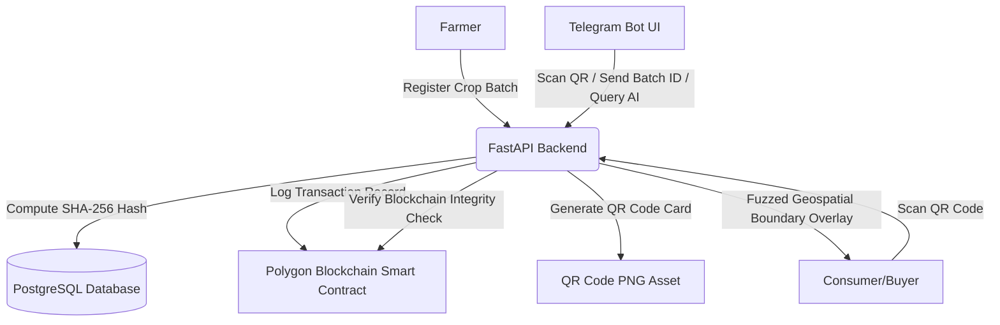

# 🛡️ AgriTrace Supply Chain Ledger

**Decentralized Blockchain Verification, Computer Vision Diagnostics, & RAG AI Assistant for Agricultural Logistics**

AgriTrace is a modern, enterprise-grade supply chain tracking system designed to verify the authenticity of farm produce. It combines **Polygon Blockchain Ledger smart contracts**, **Computer Vision (YOLOv8 & ViT)** crop diagnostics, **LangGraph RAG AI Assistants**, and **Leaflet Geospatial boundaries mapping** to prevent supply chain fraud and support farmers.

---

## 🗺️ System Architecture



---

## 🛠️ Tech Stack & Key Modules

| Layer | Technologies & Frameworks |
| :--- | :--- |
| **Frontend** | React, Vite, Vanilla CSS, React Router, Axios, i18next (Multilingual), Leaflet.js |
| **Backend** | Python 3.10+, FastAPI, SQLAlchemy (Async pg), Uvicorn |
| **Database** | PostgreSQL |
| **Blockchain** | Solidity, Web3.py, Polygon network |
| **AI Vision** | YOLOv8 (Crop detection), ViT / OpenCV (Disease & Quality Diagnostics) |
| **AI Chatbot** | LangGraph, LangChain, OpenRouter Gemini 2.5, Vector DB Document RAG |
| **Helpline Integrations** | Telegram Bot API Webhook |

---

## 📦 Project Structure

```text
Agriculture project/
├── backend/                  # FastAPI REST API + Async PostgreSQL
│   ├── app/                  # Main FastAPI Application
│   │   ├── models/           # SQLAlchemy DB Models
│   │   ├── routers/          # API Route Controllers (Auth, Crops, Telegram, etc.)
│   │   ├── services/         # Business Logic Layers (Email, Verification, RAG)
│   │   └── database.py       # Async SQLAlchemy Session Engine
│   ├── computer_vision/      # YOLOv8 & ViT Image Diagnostics Pipelines
│   ├── telegram/             # Telegram Bot Event Handler & Webhook router
│   └── requirements.txt      # Python Dependencies
├── frontend/                 # React + Vite Client Application
│   ├── src/
│   │   ├── components/       # Shared UI Widgets (LeafletMap, Tour, Onboarding)
│   │   ├── pages/            # View Pages (Forgot Password, Dashboards, About)
│   │   └── services/         # Axios API layer
│   └── package.json          # Node.js dependencies & scripts
├── agritrace_database_schema.sql  # Database Schema Import Queries (PostgreSQL)
└── README.md                 # Setup & Operating Manual
```

---

## 🚀 Setup & Installation Guide

Follow these sequential steps to clone, configure, and boot the AgriTrace application on a new system:

### 1. Clone & Prepare Directory
Extract the zip folder or clone the repository from GitHub:
```bash
git clone <repository-url>
cd "Agriculture project"
```

---

### 2. Configure PostgreSQL Database
AgriTrace uses a PostgreSQL database. Follow these steps to initialize it:
1. Open **pgAdmin 4** (or your preferred PostgreSQL client).
2. Create a new database named `agritrace_db`.
3. Open the **Query Tool** on `agritrace_db`.
4. Open the [agritrace_database_schema.sql](file:///d:/Agriculture%20project/agritrace_database_schema.sql) file located in the project root.
5. Copy all the query code, paste it into the **Query Tool** editor, and click **Execute (F5)**.
6. The entire relational schema (42 tables, PK/FK indexes, constraints, cascades, and default admin credentials) will be created instantly.

---

### 3. Backend Setup & Configuration
1. Navigate to the `backend` directory:
   ```bash
   cd backend
   ```
2. Create and activate a Python virtual environment:
   ```bash
   python -m venv venv
   
   # Windows (PowerShell)
   venv\Scripts\Activate.ps1
   
   # macOS / Linux
   source venv/bin/activate
   ```
3. Install the dependencies:
   ```bash
   pip install -r requirements.txt
   ```
4. Configure environment variables. Rename `.env.example` to `.env` or edit the existing `backend/.env` file:
   * **Database**: `DATABASE_URL=postgresql+asyncpg://<username>:<password>@localhost:5432/agritrace_db`
   * **AI API Key**: `OPENROUTER_API_KEY=your_key` (Required for Gemini-based crop checks and RAG assistant)
   * **Gmail SMTP**: `SMTP_USERNAME=your_email` and `SMTP_PASSWORD=your_app_password` (Required for OTP email recovery and tamper alerts)
   * **Telegram Bot**: `TELEGRAM_BOT_TOKEN=your_bot_token` (Required to run the verification chatbot bot)

---

### 4. Frontend Setup
1. Open a new terminal and navigate to the `frontend` directory:
   ```bash
   cd frontend
   ```
2. Install npm dependencies:
   ```bash
   npm install
   ```

---

## 🏃 Run Instructions

### Start the Backend (Terminal 1)
Make sure the Python virtual environment is active inside `backend`:
```bash
# From the backend directory
python run.py
```
* **REST API Address**: `http://localhost:8000`
* **Swagger Interactive Docs**: `http://localhost:8000/docs`

### Start the Frontend (Terminal 2)
```bash
# From the frontend directory
npm run dev
```
* **Frontend Dashboard Portal**: `http://localhost:5173`

---

## 🔒 Default Logins & Access

### System Administrator
* **Email**: `admin@agritrace.com`
* **Password**: `Admin@123`
* **Workflow**: Login to verify pending farmers, review fraud score monitor sections, examine blockchain tampering logs, and check Leaflet maps for exact surveyor boundaries.

### Farmer & Buyer
* Use the corresponding **Register** screens to create test accounts:
  * Farmers require location coordinates (Latitude, Longitude) for boundary maps.
  * Security questions must be configured during registration to enable the password recovery portal fallback mechanism.

---

## 🤖 Advanced AI Features & Integrations

### 1. Leaflet Interactive Maps
* **Farmers & Admins**: View exact coordinate coordinates and surveyor land boundaries polygon.
* **Buyers**: Restricted coordinates (privacy fuzzing). Shows a fuzzed village/district overlay circle.
* Hover the layer icon in the map corner to switch dynamically between **🛰️ Satellite View**, **🗺️ Street View**, and **🌙 Dark View**!

### 2. Multi-Factor Password Recovery
* Try standard email passcode verification or trigger the **"Try another way"** route to answer your registered security question to reset passwords securely.

### 3. Telegram Verification Bot
1. Linked accounts can verify crop authenticity directly via Telegram!
2. Send `verify <Batch_ID>` (e.g. `verify AGR-7128AEECBFD4`) to receive a cryptographic ledger verification report.
3. Send a photo of a crop QR card — the bot uses OpenCV to decode the QR payload, checks it against the database ledger, and returns the verification report instantly!
4. Send an organic leaf photo to scan and receive AI crop diagnostics, severity checks, and treatment guides.

---

## 🧪 Verification & Testing
To ensure the system works as expected on the target laptop, run the pytest integration test suite:
```bash
# From the project root
$env:PYTHONPATH="backend"; pytest tests/e2e/test_auth.py
```
This tests registration, OTP generations, forgot password recovery flows, and Leaflet bounds checks.
